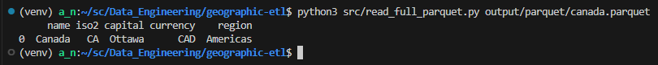

# Geographic Data ETL Pipeline

A practice project demonstrating a full ETL pipeline using:
- **SQLite** for data storage
- **Parquet** for efficient columnar output
- **Open geographic data** from [countries-states-cities-database](https://github.com/dr5hn/countries-states-cities-database)

## 📦 Requirements
- Python 3.10+
- Packages: `pandas`, `pyarrow`, `requests`, `sqlite3`

## ▶️ How to Run

1. Clone the repo:
   ```bash
   git clone git@github.com:ArturNut/geographic-etl.git
   cd geographic-etl
   ```

2. Set up virtual environment:
    ```bash
    python3 -m venv venv
    source venv/bin/activate  # Linux/macOS
    pip install -r requirements.txt
    ```
3. Run the pipeline:
    ```bash
    python3 src/download_countries.py
    python3 src/load_countries.py
    python3 src/etl.py data/geography.db queries/canada_info.sql canada.parquet
    python3 src/read_full_parquet.py output/parquet/canada.parquet    
    ```

4. Result:  

     
## 🗂️ Project Structure
  * src/ — executable scripts
  * queries/ — SQL templates
  * data/ — raw and processed data (generated)
  * output/ — final results in CSV/Parquet  

## 📌 Note
    This project is designed for learning and portfolio purposes.